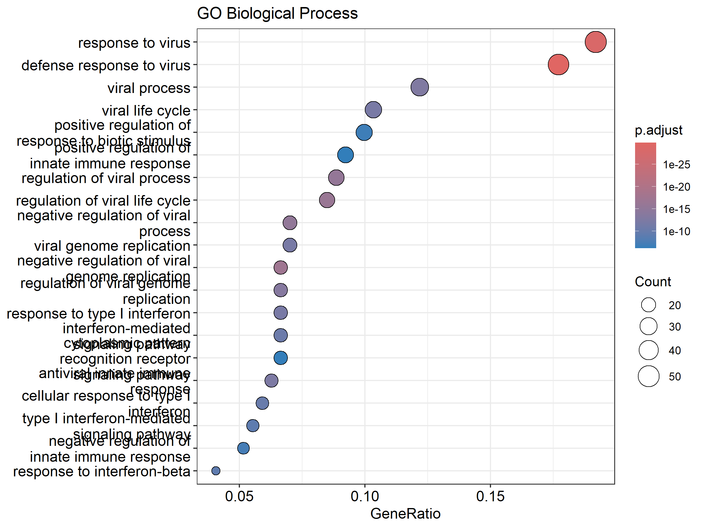
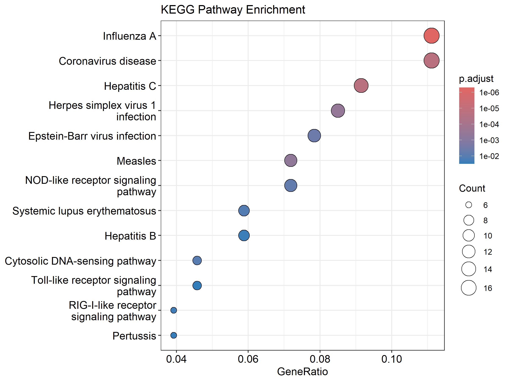

# RNA-seq Differential Expression Analysis GSE201530

[](https://www.r-project.org)
[](https://bioconductor.org)
[](https://bioconductor.org/packages/release/bioc/html/DESeq2.html)
[](LICENSE)
[](https://github.com/simbisaichinhema/RNA-seq-Differential-Expression-Analysis-DESeq2)
[](https://github.com/simbisaichinhema/RNA-seq-Differential-Expression-Analysis-DESeq2/stargazers)
[](https://github.com/simbisaichinhema/RNA-seq-Differential-Expression-Analysis-DESeq2/issues)
[](https://github.com/simbisaichinhema/RNA-seq-Differential-Expression-Analysis-DESeq2/releases)

## Project Description

A complete, reproducible bioinformatics workflow for comparative RNA-seq analysis of vaccinated and unvaccinated individuals infected with SARS-CoV-2. The project downloads raw data from GEO dataset **GSE201530**, performs differential gene expression analysis using **DESeq2**, and characterizes enriched biological processes and pathways via **clusterProfiler** and **pathview**.

All results, figures, and scripts are included — the repository is fully reproducible and suitable for use as a teaching resource or portfolio project.

## Background

SARS-CoV-2 vaccination has been shown to modulate innate and adaptive immune responses. Transcriptomic profiling of peripheral blood mononuclear cells (PBMCs) from vaccinated versus unvaccinated individuals following Omicron infection reveals distinct gene expression signatures. Understanding these signatures at the pathway level provides insight into how prior vaccination shapes the antiviral immune response. This project reanalyses the public GEO dataset GSE201530 using standard differential expression and enrichment workflows to identify and characterize these signatures.

## Objectives

The objective of this project is **not** to prove a hypothesis but to:

1. Download and prepare RNA-seq data from GEO.
2. Perform quality control and DESeq2 differential expression analysis.
3. Visualize results with publication-quality figures.
4. Characterize enriched Gene Ontology (GO) terms and KEGG pathways.
5. Provide a complete, reproducible, and beginner-friendly workflow.

## Workflow

```
GEO Data Download (GSE201530)
        ↓
   Read & Prepare Metadata
        ↓
   Build Count Matrix
        ↓
   Quality Control (PCA, Sample Distance)
        ↓
   DESeq2 Normalization & Differential Expression
        ↓
   Visualization (MA Plot, Volcano Plot, Heatmaps)
        ↓
   GO Enrichment (BP, MF, CC)
        ↓
   KEGG Pathway Enrichment
        ↓
   Pathview Visualization & Biological Interpretation
        ↓
   Final Report & Presentation
```

## Installation

### Prerequisites

- R (≥ 4.0)
- Bioconductor (≥ 3.18)

### Setup

```bash
## Clone the repository
git clone https://github.com/simbisaichinhema/RNA-seq-Differential-Expression-Analysis-DESeq2.git
cd RNA-seq-Differential-Expression-Analysis-DESeq2

## Install Bioconductor packages (run once)
Rscript scripts/05_functional_enrichment.R  # Installs required packages
```

### Required R Packages

| Package | Source | Purpose |
|---------|--------|---------|
| DESeq2 | Bioconductor | Differential expression |
| clusterProfiler | Bioconductor | GO & KEGG enrichment |
| enrichplot | Bioconductor | Enrichment visualization |
| pathview | Bioconductor | KEGG pathway diagrams |
| ggplot2 | CRAN | Publication-quality plots |
| pheatmap | CRAN | Heatmap visualization |
| EnhancedVolcano | Bioconductor | Volcano plots |
| GEOquery | Bioconductor | GEO data access |
| org.Hs.eg.db | Bioconductor | Human gene annotation |
|AnnotationDbi | Bioconductor | Annotation infrastructure |
| ggrepel | CRAN | Non-overlapping text labels |
| dplyr | CRAN | Data manipulation |
| readr | CRAN | CSV/TSV I/O |

## Folder Structure

```
RNA-seq-Differential-Expression-Analysis-DESeq2/
├── README.md                  # This file
├── LICENSE                    # MIT License
├── CITATION.cff               # Machine-readable citation
├── .gitignore                 # Exclude generated files
│
├── data/
│   ├── raw/                   # GEO count matrix & series matrix
│   ├── metadata/              # Sample metadata
│   └── processed/             # Intermediate processed files
│
├── scripts/                   # All analysis scripts
│   ├── 01_download_data.R
│   ├── 02_prepare_metadata.R
│   ├── 03_deseq2_analysis.R
│   ├── 04_visualization.R
│   ├── 05_functional_enrichment.R
│   └── utils.R
│
├── figures/                   # Project overview figures
├── results/
│   ├── csv/                   # CSV result tables
│   ├── plots/                 # All publication-quality figures
│   └── pathway/               # Pathview pathway outputs
│
├── docs/
│   ├── images/                # Documentation images
│   ├── report/                # Formal scientific report
│   └── presentation/          # Slide deck source
│
└── workflow/                  # Workflow description
```

## How to Run

Each script is self-contained and documents its own inputs, outputs, and expected runtime. From the repository root:

```bash
## Step 1 — Download data from GEO
Rscript scripts/01_download_data.R

## Step 2 — Prepare metadata
Rscript scripts/02_prepare_metadata.R

## Step 3 — DESeq2 differential expression
Rscript scripts/03_deseq2_analysis.R

## Step 4 — Visualization
Rscript scripts/04_visualization.R

## Step 5 — Functional enrichment
Rscript scripts/05_functional_enrichment.R
```

Alternatively, run the full pipeline from a single call:

```bash
Rscript scripts/03_deseq2_analysis.R  # Includes QC, DESeq2, and visualization
Rscript scripts/05_functional_enrichment.R  # GO & KEGG enrichment
```

### Expected Runtime

| Script | Approximate Runtime |
|--------|-------------------|
| `01_download_data.R` | 2–5 min |
| `02_prepare_metadata.R` | 1–2 min |
| `03_deseq2_analysis.R` | 3–8 min |
| `04_visualization.R` | 2–5 min |
| `05_functional_enrichment.R` | 5–15 min |

## Expected Outputs

| Location | Contents |
|----------|----------|
| `results/csv/DESeq2_Results.csv` | Full DESeq2 results for all genes |
| `results/csv/Significant_Genes.csv` | Genes with adjusted p-value < 0.05 and \|log2FC\| > 1 |
| `results/csv/Upregulated_Genes.csv` | Upregulated genes (log2FC > 1, padj < 0.05) |
| `results/csv/Downregulated_Genes.csv` | Downregulated genes (log2FC < −1, padj < 0.05) |
| `results/csv/GO_BP.csv` | GO Biological Process enrichment |
| `results/csv/GO_MF.csv` | GO Molecular Function enrichment |
| `results/csv/GO_CC.csv` | GO Cellular Component enrichment |
| `results/csv/KEGG.csv` | KEGG pathway enrichment |
| `results/plots/PCA_plot.png/pdf` | Principal component analysis |
| `results/plots/Sample_Distance_Heatmap.png/pdf` | Sample distance heatmap |
| `results/plots/Heatmap.png/pdf` | Top 50 DE genes heatmap |
| `results/plots/MA_plot.png/pdf` | MA plot |
| `results/plots/Volcano_plot.png/pdf` | Volcano plot |
| `results/plots/GO_BP_Dotplot.png/pdf` | GO BP dotplot |
| `results/plots/GO_BP_Barplot.png/pdf` | GO BP barplot |
| `results/plots/GO_MF_Dotplot.png/pdf` | GO MF dotplot |
| `results/plots/GO_MF_Barplot.png/pdf` | GO MF barplot |
| `results/plots/GO_CC_Dotplot.png/pdf` | GO CC dotplot |
| `results/plots/GO_CC_Barplot.png/pdf` | GO CC barplot |
| `results/plots/KEGG_Dotplot.png/pdf` | KEGG dotplot |
| `results/plots/KEGG_Barplot.png/pdf` | KEGG barplot |
| `results/plots/GO_BP_EnrichmentMap.png/pdf` | GO BP enrichment network |
| `results/plots/GO_BP_Cnetplot.png/pdf` | GO BP gene-concept network |
| `results/plots/GO_BP_Treeplot.png/pdf` | GO BP treeplot |
| `results/plots/KEGG_EnrichmentMap.png/pdf` | KEGG enrichment network |
| `results/plots/KEGG_Cnetplot.png/pdf` | KEGG gene-concept network |
| `results/pathway/hsa05164.png` | KEGG Coronavirus disease pathway |

## Results Summary

| Metric | Value |
|--------|-------|
| Total genes analysed | 23,138 |
| Upregulated genes (padj < 0.05, log2FC > 1) | 445 |
| Downregulated genes (padj < 0.05, log2FC < −1) | 74 |
| GO Biological Process terms enriched | 156 |
| GO Molecular Function terms enriched | 17 |
| GO Cellular Component terms enriched | 5 |
| KEGG pathways enriched | 13 |

### Top Enriched GO Biological Processes

- Response to virus
- Defense response to virus
- Type I interferon signaling
- Regulation of viral genome replication
- Antiviral innate immune response
- Viral process

### Top Enriched KEGG Pathways

- Coronavirus disease (COVID-19)
- Influenza A
- NOD-like receptor signaling pathway
- RIG-I-like receptor signaling pathway
- Toll-like receptor signaling pathway
- Cytosolic DNA sensing pathway
- Hepatitis C
- Herpes simplex virus infection

## Figures

### PCA Plot


### Volcano Plot


### Heatmap of Differentially Expressed Genes


### GO BP Dotplot



### KEGG Dotplot



### KEGG Coronavirus Disease Pathway (pathview)


## References

- GEO Accession: [GSE201530](https://www.ncbi.nlm.nih.gov/geo/query/acc.cgi?acc=GSE201530)
- DESeq2: Love, M. I., Huber, W., & Anders, S. (2014). *Genome Biology*, 15(12), 550. DOI: [10.1186/s13059-014-0550-8](https://doi.org/10.1186/s13059-014-0550-8)
- clusterProfiler: Yu, G., Wang, L. G., Han, Y., & He, Q. Y. (2012). *OMICS*, 16(5), 284–287. DOI: [10.1089/omi.2011.0118](https://doi.org/10.1089/omi.2011.0118)
- pathview: Luo, W., & Brouwer, C. (2013). *Bioinformatics*, 29(14), 1830–1831. DOI: [10.1093/bioinformatics/btt285](https://doi.org/10.1093/bioinformatics/btt285)
- GEOquery: Davis, S., & Meltzer, P. S. (2007). *Bioinformatics*, 23(15), 2051–2052. DOI: [10.1093/bioinformatics/btm301](https://doi.org/10.1093/bioinformatics/btm301)

## Citation

Simbisai Chinhema (2026). *Comparative RNA-seq Analysis of Vaccinated and Unvaccinated Individuals Infected with SARS-CoV-2 Using DESeq2 and Functional Enrichment Analysis*. Version 1.0.0. GitHub repository: https://github.com/simbisaichinhema/RNA-seq-Differential-Expression-Analysis-DESeq2

```bibtex
@software{chinhema2026rnaseq,
  author  = {Simbisai Chinhema},
  title   = {Comparative RNA-seq Analysis of Vaccinated and Unvaccinated Individuals Infected with SARS-CoV-2 Using DESeq2 and Functional Enrichment Analysis},
  year    = {2026},
  version = {1.0.0},
  url     = {https://github.com/simbisaichinhema/RNA-seq-Differential-Expression-Analysis-DESeq2},
  license = {MIT},
  note    = {Bioinformatics pipeline using DESeq2, clusterProfiler, pathview, and GEOquery}
}
```

## Author

**Simbisai Chinhema** — Bioinformatics

## Contributors

- **Simbisai Chinhema** — Bioinformatics (Author & Developer)

## License

This project is licensed under the [MIT License](LICENSE).

## Acknowledgements

- GEO consortium for hosting the GSE201530 dataset.
- The Bioconductor and R communities for maintaining DESeq2, clusterProfiler, pathview, and related packages.
- Original study authors: Prior vaccination exceeds prior infection in eliciting innate and humoral immune responses in Omicron infected outpatients.
# RNA-seq-Differential-Expression-Analysis-DESeq2
