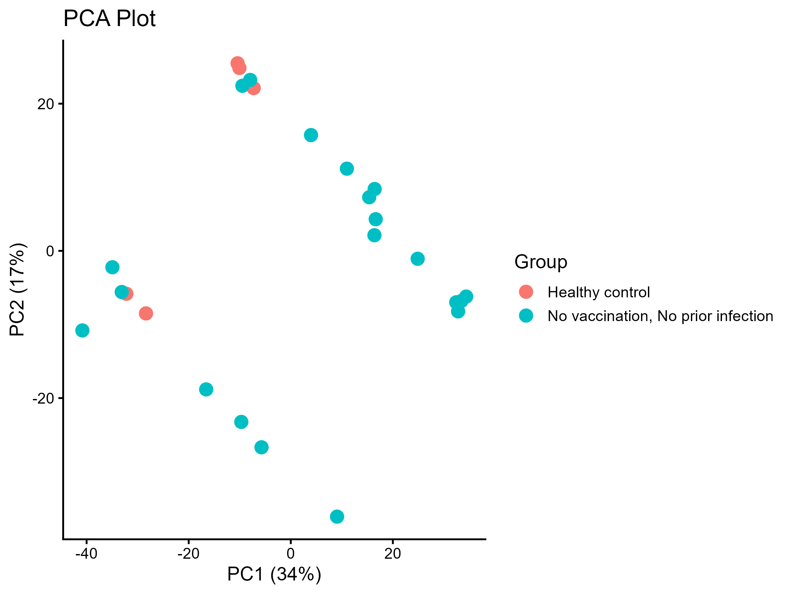
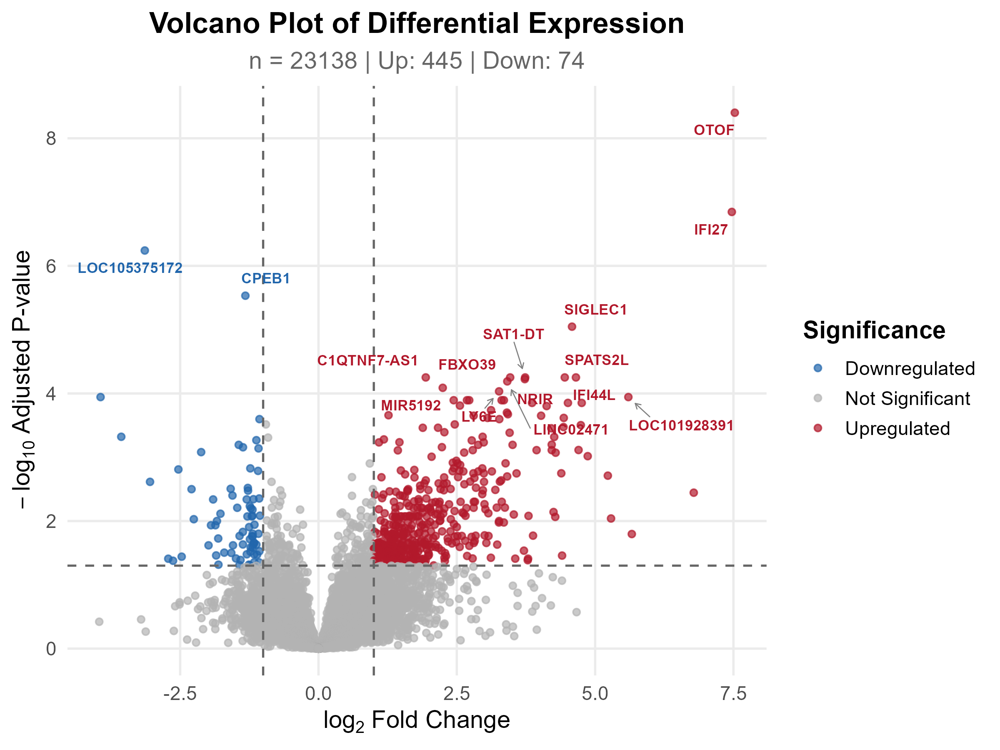
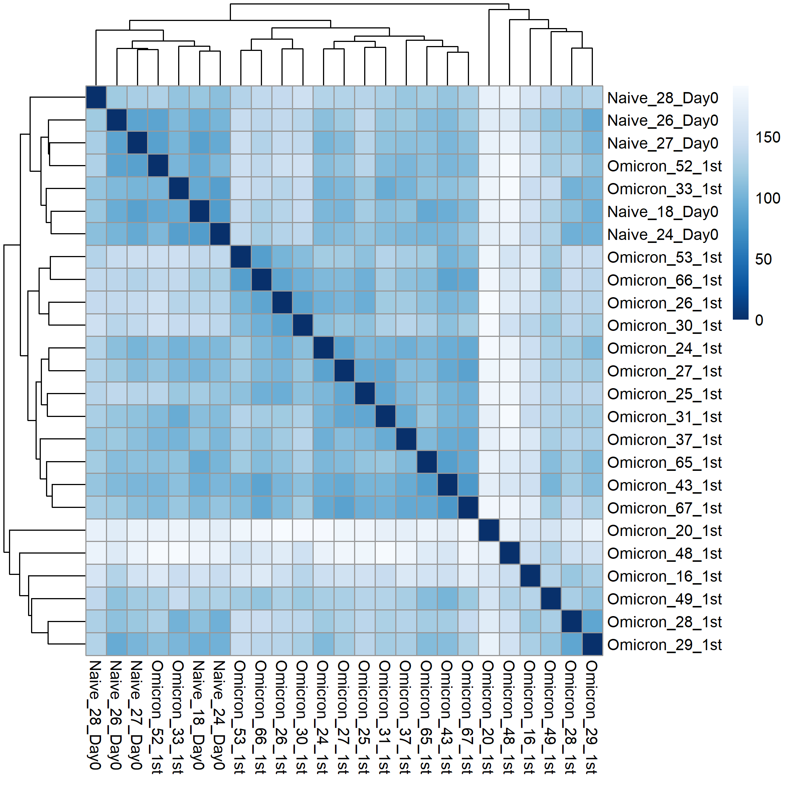
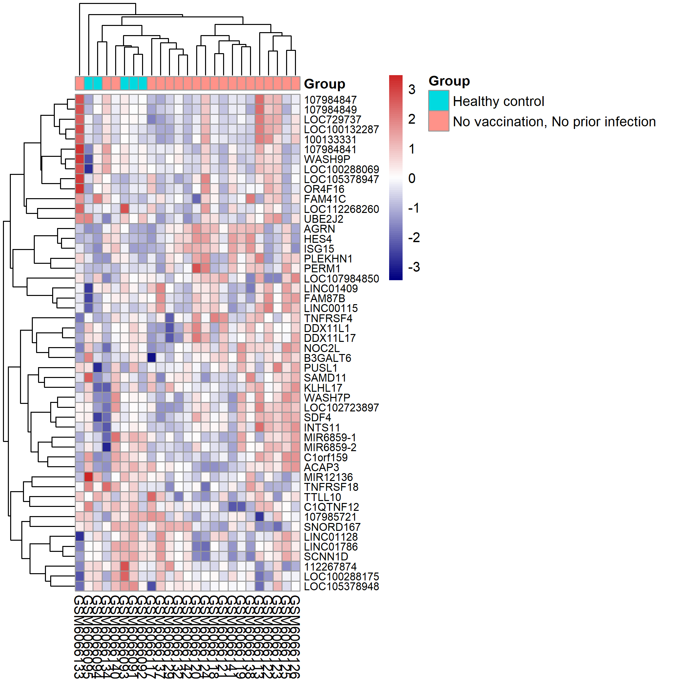
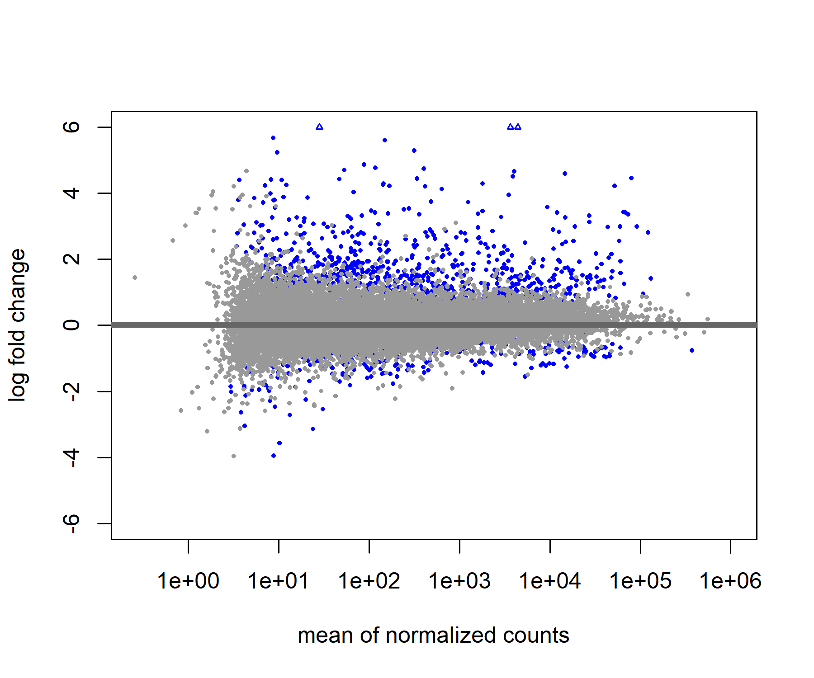
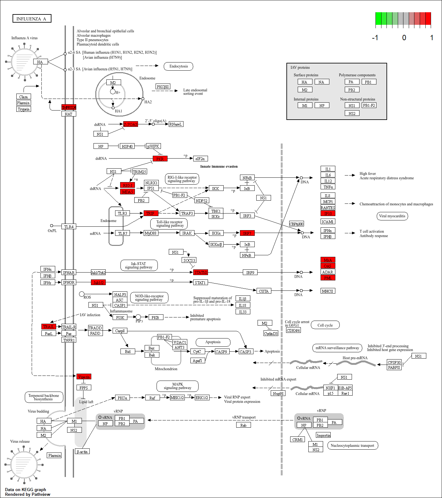

# Results

## Differential Expression Summary

| Metric | Value |
|--------|-------|
| Total genes analysed | 23,138 |
| Genes passing filter | Varies (see pipeline) |
| Significantly upregulated (padj < 0.05, log2FC > 1) | **445** |
| Significantly downregulated (padj < 0.05, log2FC < −1) | **74** |

### Top Upregulated Genes

| Gene Symbol | Gene ID | log2 Fold Change | Adjusted p-value |
|-------------|---------|------------------|------------------|
| OTOF | 9381 | 7.52 | 3.97 × 10⁻⁹ |
| IFI27 | 3429 | 7.47 | 1.43 × 10⁻⁷ |
| SIGLEC1 | 6614 | 4.58 | 8.97 × 10⁻⁶ |
| IFI44L | 10964 | 4.45 | 5.61 × 10⁻⁵ |
| SPATS2L | 26010 | 4.65 | 5.61 × 10⁻⁵ |
| FBXO39 | 162517 | 3.46 | 5.61 × 10⁻⁵ |
| LY6E | 4061 | 3.26 | 9.27 × 10⁻⁵ |

### Top Downregulated Genes

| Gene Symbol | Gene ID | log2 Fold Change | Adjusted p-value |
|-------------|---------|------------------|------------------|
| LOC105375172 | 105375172 | −3.14 | 5.74 × 10⁻⁷ |
| CPEB1 | 64506 | −1.32 | 2.93 × 10⁻⁶ |

## Visualization

### PCA Plot

The PCA plot shows clear separation between the healthy control group and the unvaccinated infected group along the first principal component, confirming that the two groups have globally distinct transcriptomic profiles.

### Volcano Plot

The volcano plot displays the distribution of all tested genes by log2 fold change and adjusted p-value. A total of **519** genes pass the significance thresholds (padj < 0.05, |log2FC| > 1), with **445** upregulated and **74** downregulated.

### Sample Distance Heatmap

The sample distance heatmap confirms that biological replicates cluster together and that the two groups form distinct clusters, with no obvious outliers.

### Heatmap of Top 50 Differentially Expressed Genes

The heatmap of the top 50 most significantly differentially expressed genes shows clear separation between healthy controls and unvaccinated infected individuals. Upregulated genes (red) are predominantly enriched in the infected group, while downregulated genes (blue) are predominantly in the healthy control group.

### MA Plot

The MA plot shows the relationship between mean expression and log2 fold change for all genes. Differentially expressed genes are clearly visible as points deviating from the horizontal midline, particularly at higher fold changes.

## Functional Enrichment Summary

### GO Biological Process

A total of **156** GO biological process terms were significantly enriched among the upregulated genes. The top enriched terms are dominated by antiviral immune response categories:

| GO Term | Description | Gene Ratio | Fold Enrichment | Adjusted p-value |
|---------|-------------|-----------|-----------------|------------------|
| GO:0051607 | Defense response to virus | 48/271 | 10.00 | 1.66 × 10⁻³⁰ |
| GO:0009615 | Response to virus | 52/271 | 8.13 | 4.37 × 10⁻²⁹ |
| GO:0045071 | Negative regulation of viral genome replication | 18/271 | 25.05 | 5.08 × 10⁻¹⁸ |
| GO:0050792 | Regulation of viral process | 24/271 | 11.85 | 2.45 × 10⁻¹⁶ |
| GO:0140374 | Antiviral innate immune response | 17/271 | 14.98 | 3.78 × 10⁻¹³ |

### GO Molecular Function

A total of **17** GO molecular function terms were enriched, with RNA-binding and ATP-hydrolysis activities prominent:

| GO Term | Description | Gene Ratio | Fold Enrichment | Adjusted p-value |
|---------|-------------|-----------|-----------------|------------------|
| GO:0003725 | Double-stranded RNA binding | 11/281 | 9.49 | 1.06 × 10⁻⁵ |
| GO:0016779 | Nucleotidyltransferase activity | 11/281 | 4.97 | 3.70 × 10⁻³ |
| GO:0003727 | Single-stranded RNA binding | 8/281 | 5.90 | 1.10 × 10⁻² |
| GO:0016763 | Pentosyltransferase activity | 6/281 | 8.13 | 1.10 × 10⁻² |
| GO:0001786 | Phosphatidylserine binding | 6/281 | 6.53 | 1.63 × 10⁻² |

### GO Cellular Component

A total of **5** GO cellular component terms were enriched:

| GO Term | Description | Gene Ratio | Fold Enrichment | Adjusted p-value |
|---------|-------------|-----------|-----------------|------------------|
| GO:0032993 | Protein-DNA complex | 14/288 | 4.02 | 3.71 × 10⁻³ |
| GO:0000786 | Nucleosome | 9/288 | 4.62 | 1.37 × 10⁻² |
| GO:0044217 | Other organism part | 5/288 | 9.62 | 1.37 × 10⁻² |
| GO:0106139 | Symbiont cell surface | 4/288 | 13.85 | 1.37 × 10⁻² |
| GO:0043202 | Lysosomal lumen | 7/288 | 4.90 | 3.71 × 10⁻² |

### KEGG Pathway Enrichment

A total of **13** KEGG pathways were significantly enriched:

| Pathway ID | Description | Gene Ratio | Fold Enrichment | Adjusted p-value |
|-----------|-------------|-----------|-----------------|------------------|
| hsa05164 | Coronavirus disease | 17/153 | 4.38 | 3.03 × 10⁻⁷ |
| hsa05160 | Influenza A | 17/153 | 6.05 | 2.47 × 10⁻⁹ |
| hsa04621 | NOD-like receptor signaling pathway | 11/153 | 3.62 | 2.27 × 10⁻⁶ |
| hsa04623 | Cytosolic DNA-sensing pathway | 7/153 | 5.19 | 1.01 × 10⁻³ |
| hsa04622 | RIG-I-like receptor signaling pathway | 6/153 | 5.13 | 1.08 × 10⁻² |
| hsa04620 | Toll-like receptor signaling pathway | 7/153 | 3.95 | 3.15 × 10⁻² |
| hsa05168 | Herpes simplex virus 1 infection | 13/153 | 4.45 | 6.84 × 10⁻⁶ |
| hsa05162 | Measles | 11/153 | 4.98 | 1.23 × 10⁻⁵ |
| hsa05169 | Epstein-Barr virus infection | 12/153 | 3.60 | 1.23 × 10⁻⁴ |
| hsa05171 | SARS-CoV-2 — Coronavirus disease (COVID-19) | 17/153 | 4.38 | 3.03 × 10⁻⁷ |
| hsa05161 | Hepatitis B | 9/153 | 3.40 | 1.33 × 10⁻³ |
| hsa05322 | Systemic lupus erythematosus | 9/153 | 3.87 | 5.20 × 10⁻⁴ |
| hsa05133 | Pertussis | 6/153 | 4.74 | 1.63 × 10⁻³ |

### Key Enriched Pathway: Coronavirus Disease (hsa05164)

The Coronavirus disease (COVID-19) KEGG pathway (hsa05164) was among the top enriched pathways, reflecting the strong upregulation of interferon-stimulated genes (ISGs), antiviral effectors, and innate immune signaling components in the unvaccinated infected group. The pathview visualization highlights the genes mapped to this pathway, showing which nodes are most strongly modulated.

